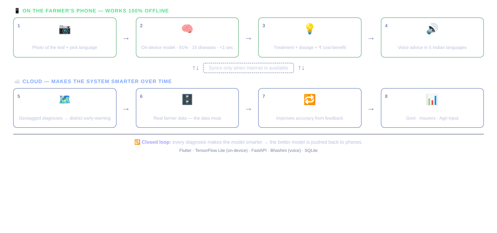

# 🌱 KisanMitra — Offline AI Crop Doctor for Indian Farmers

**An offline, voice-first AI crop-disease advisor that runs entirely on a farmer's phone — no internet, no server.**

Built for **HackFusion @ CIT**.



---

## The problem

About **86% of Indian farmers** are smallholders with under 2 hectares. When disease hits a crop, they often don't know *what it is*, *what to spray*, or *how much*. Existing apps fail them for three reasons: village internet is weak or absent, the apps are in English text, and the nearest agri-officer may be 40+ km away.

## The solution

A farmer photographs a diseased leaf. An **on-device AI model** identifies the disease in under a second — completely offline — then the app **speaks** the exact treatment, dosage, and a rupee-based recommendation in the farmer's own language.

It doesn't just diagnose. It decides:

> *"Tomato Late Blight, severe. Spray Copper Oxychloride 3g/litre. Rain is coming — spray this evening. Costs ₹565, saves about ₹89,100 of your crop."*

---

## Key features

| Feature | Detail |
|---|---|
| **100% offline on-device AI** | Trained CNN embedded in the app — no internet, no server, no data cost |
| **Instant photo diagnosis** | 15 diseases across 3 crops · **91.4% validation accuracy** · <1 sec inference |
| **Voice-first, 5 languages** | Spoken advice in Hindi, Tamil, Telugu, Marathi, English — no reading required |
| **Smart cost–benefit advisory** | Medicine + dosage + weather-aware timing + rupee savings |
| **Community outbreak map** | Geotagged diagnoses build a district-level disease early-warning network |
| **Safety & photo validation** | Pre-harvest-interval + dosage warnings; rejects non-leaf photos with guided errors |

---

## The model

| | |
|---|---|
| Architecture | 4-block CNN (32/64/96/128) + dense 128, trained from scratch |
| Dataset | **PlantVillage — 7,025 real leaf photos** (tomato / potato / bell pepper) |
| Validation accuracy | **91.4%** on 1,053 held-out real photos |
| Edge model size | **0.22 MB** quantized TensorFlow Lite |
| Classes | 15 (incl. healthy for each crop) |

Per-class accuracy is in [`backend/models/metrics.json`](backend/models/metrics.json). Several classes score 96–100%; the weakest are Spider Mites and Target Spot, which more training data would improve.

---

## Quick start

### Run the app (no install needed)

Open **`KisanMitra_app.html`** in any browser — desktop or phone. The trained model is embedded in the file, so it works with your Wi-Fi turned off.

Pick a language and crop → tap a real sample leaf (or upload one from [`docs/sample_leaves/`](docs/sample_leaves)) → **Diagnose** → tap 🔊 to hear the advice.

### Run the backend

```bash
cd backend
pip install -r requirements.txt
uvicorn app.main:app --reload --port 8000
# API docs: http://localhost:8000/docs
```

### Retrain the model

```bash
python backend/train/prep_real.py   # builds arrays from real PlantVillage photos
python backend/train/train.py       # trains, evaluates, exports model.tflite
python backend/train/build_web_model.py  # embeds the model into the web app
```

---

## API

| Method | Endpoint | Purpose |
|---|---|---|
| `GET` | `/health` | Model status and version |
| `GET` | `/api/diseases` | Full disease knowledge base |
| `POST` | `/api/diagnose` | **Image → disease + treatment + economics + spoken advice** |
| `POST` | `/api/advisory` | Advice for a known disease label (no image) |
| `POST` | `/api/reports` | Submit a geotagged outbreak report |
| `GET` | `/api/reports` | Outbreak map data and stats |

---

## Repository layout

```
KisanMitra_app.html     ← the complete offline app (model embedded)
app_template.html       ← app source before model injection
backend/
  app/                  FastAPI service (diagnose, advisory, outbreak map)
  models/               Trained model: model.tflite, model.keras, metrics.json
  train/                Data prep, training, and web-export pipeline
  tests/                End-to-end API test
docs/sample_leaves/     30 real held-out leaf photos for testing
assets/                 Architecture diagrams
```

---

## Tech stack

TensorFlow / TensorFlow Lite (on-device inference) · FastAPI · SQLite · Flutter (production app target) · Bhashini (voice, production)

---

## Roadmap

- **Phase 1 — done:** working offline prototype, trained model, backend, tests
- **Phase 2:** field pilot with an FPO / Krishi Vigyan Kendra (200–500 farmers) to collect real ground truth and push accuracy toward ~97% via transfer learning
- **Phase 3:** scale through government extension services, crop insurers, and agri-input partners

---

## Disclaimer

Treatment and dosage data is indicative and intended for demonstration. Always confirm with a certified agricultural expert before spraying.
